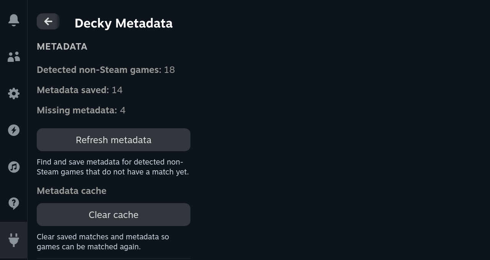
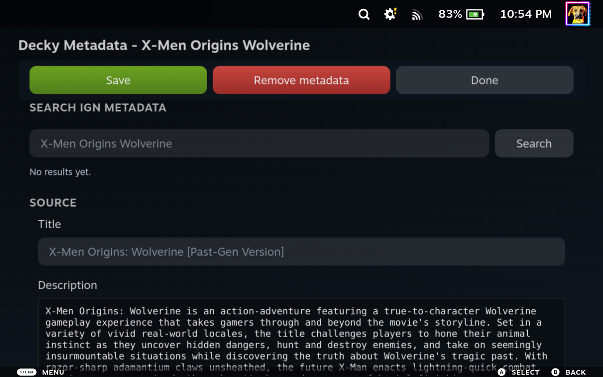
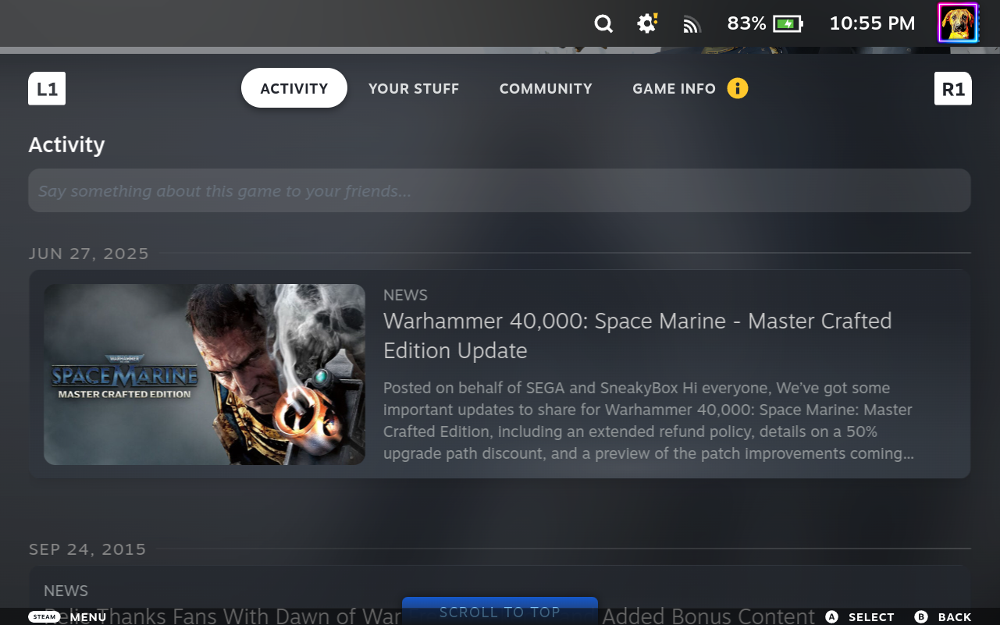

# Decky Metadata

[](LICENSE)
[](https://github.com/beallio/Decky-Metadata/releases/latest)
[](https://github.com/beallio/Decky-Metadata/actions/workflows/ci.yml)

<!-- Badges may require GitHub authentication while this repository is private. -->

Decky Metadata is a Decky Loader plugin for Steam Big Picture and Steam Gaming Mode.

**Supported platforms**: SteamOS / Steam Deck via Decky Loader.

The plugin helps non-Steam games look and behave more like native Steam library entries by adding editable metadata, Steam community media, store categories, matched Steam activity news, and a cached delisted-app index.

## Installation

### Install from GitHub Releases

Download the latest stable [`Decky-Metadata.zip`](https://github.com/beallio/Decky-Metadata/releases/latest) and sideload it through Decky's developer-mode plugin installer. The rolling [`dev` prerelease](https://github.com/beallio/Decky-Metadata/releases/tag/dev) is the testing channel and may be less stable.

### Build from source

For manual installation, generate a Decky sideload ZIP from this checkout:

```bash
npm install
npm run build
npm run package
```

`npm run package` creates `Decky-Metadata.zip` in the repository root (containing a `Decky-Metadata/` plugin folder). The filename is always fixed; the version — including the current git short hash for local builds, e.g. `0.1.0+a1b2c3d` — is written into the packaged `plugin.json`/`package.json` and shown in the QAM Versions panel. Use `node scripts/package.mjs --release` after `npm run build` when you need a base-version package without the hash.

Run deterministic contributor checks from the repository root:

```bash
scripts/decky doctor
scripts/decky verify-change dev --explain
scripts/install_hooks.sh --check
```

The optional canonical agent workflow skill is tracked in
`skills/decky-project-workflow`. Preview installation without changing an agent
home, or explicitly install it:

```bash
scripts/install_project_skill.sh --dest /tmp/Decky-Metadata/skill-install-test
scripts/install_project_skill.sh --agent codex --install
```

After merging `dev` into `main` with `--no-ff`, prepare a local stable release
with the guarded release driver. It creates the version commit, annotated tag,
and hash-free package but does not push:

```bash
scripts/release.sh 0.3.0
git push origin main
git push origin v0.3.0
scripts/bump_next_patch.sh
```

Pushing the stable tag publishes `Decky-Metadata.zip` on GitHub Releases.
Development packages publish automatically as a rolling prerelease whenever
`dev` is pushed; no manual packaging command is required for that channel.

## Features

- Finds missing game metadata automatically.
- Adds descriptions, developers, publishers, release dates, ratings, screenshots, and Steam info fields.
- Lets you edit metadata manually from each non-Steam game's context menu.
- Shows native Steam Community content for matched shortcuts, then fetches live Steam Community cards when a known app's native hub is empty; when Steam has no cards, it fetches fresh best-effort YouTube videos and IGN screenshots without storing Community-tab media.
- Preserves a manually pinned Steam app ID and its Steam-owned metadata when applying a fetched IGN result.
- Caches Steam's delisted-app index so removed store pages can still be matched by title.
- Rewrites Steam's native Game Info quick-links for matched shortcuts: Support and Community Market are removed, Store Page is kept unless the match is delisted, and known DLC / Points Shop links target the real Steam app. Never-on-Steam shortcuts continue to hide the row entirely.
- Supplements Controller Settings for listed and delisted matched shortcuts with the matched Steam game's Recommended / Official and Community layouts while retaining shortcut-specific personal layouts and generic templates. Identical matched-source queries reuse the existing source cache, and Controller Settings Search isolates both inactive matched sources and inactive non-Steam shortcut caches, including caches created before the current plugin session and current shortcuts with no Steam match. Previewing and selecting a borrowed layout remain Steam's native shortcut operations. If SteamUI's internal controller-layout contract is incompatible, the plugin falls back to the standard Controller Settings UI and shows one warning for the current plugin session.




## Steam Activity News

For non-Steam shortcuts that can be matched to a Steam Store app, Decky Metadata fetches Steam news and announcements and feeds them into Steam Big Picture's normal Activity area.



## Metadata Cache

The Quick Access Menu is organized into four native panels:

- **Metadata** shows detected-game, saved-metadata, and missing-metadata counts.
  `Refresh metadata` finds and saves matches for detected non-Steam games. Its
  nested **Metadata cache** subsection provides `Clear cache` so saved matches
  can be matched again.
- **Delisted Steam games** shows the cached count and update date, with
  `Refresh delisted games` to download or update the cached index.
- **Logs** provides `View Logs` for the recent bounded plugin log and the Debug
  Logging toggle.
- **Versions** shows the full `Decky Metadata: <version>` row (including the
  packaged commit suffix when present), plus the current `Decky:` loader version
  and `SteamOS:` system version.

Bulk Activity refresh is no longer exposed in the QAM. Its backend compatibility
methods remain available, and automatic/per-app Steam Activity refresh continues
to operate when matched game details are opened.

## Diagnostics

`View Logs` opens the recent tail of the existing rotating `decky-metadata.log`
inside a scrollable, selectable modal. A missing or unavailable log displays
`No recent logs`. Debug Logging enables verbose troubleshooting output and also
enables Steam navigation/history/click diagnostic traces after the next plugin
reload. The Versions panel displays the complete packaged plugin version plus the
Decky loader and SteamOS versions, each showing `Unknown` while unavailable;
release builds may show only the base plugin version.

## Notes

If you previously installed the old plugin, uninstall it before sideloading Decky Metadata. The plugin name changed, so Decky treats this as a separate plugin identity.

## License & Credits

Decky Metadata is licensed under the **GNU General Public License v3.0 or later** (see `LICENSE`).

Decky Metadata is a fork of [Playhub Metadata](https://github.com/LoZazaMastro/Playhub-Metadata)
by ZazaMastro, and is maintained by David Beall. Full credit and thanks to the original
author and contributors.

Decky Metadata was bootstrapped from the [Decky Plugin Template](https://github.com/SteamDeckHomebrew/decky-plugin-template). Full credit and thanks to the Steam Deck Homebrew contributors.

The library context-menu integration (`src/contextMenuPatch.tsx`) is derived from the
[decky-steamgriddb](https://github.com/SteamGridDB/decky-steamgriddb) plugin by the SteamGridDB
project, which is licensed under the GPL-3.0. Full credit and thanks to its authors and contributors.
